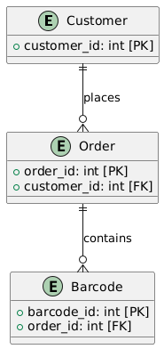

# Tiqets Assignment

This application reads CSV for order and barcode data, then processes & validates this data (relying on Pydantic) to generate customer orders and their associated barcodes. It also provides analysis on top customers and unused barcodes.


## Docker Installation

1. Make sure you have docker installed in your system.
2. Build the Docker image:
   ```
   docker build -t tiqets-assignment .
   ```

# Usage


### Docker Usage

Run the Docker container

This will process the default files `data/orders.csv` and `data/barcodes.csv` and output the result to `output/result.csv` within the container.

If you want to use your own input files or access the output file, you can still mount volumes:


```
docker run tiqets-assignment run data/orders.csv data/barcodes.csv output/result.csv
```
You can also override the default file paths:

```
docker run tiqets-assignment run path_to_your_orders.csv path_to_your_barcodes.csv path_your_result.csv
```
## Output

The application will generate:

1. A CSV file at the specified output path containing requested customer orders and their barcodes.
2. Console output will show:
   - Summary of processed data
   - Top 5 customers who bought the most tickets
   - Number of unused barcodes
   - Sample of customer orders

i.e.
     
```
Read 207 orders and 620 barcodes.
Processing data. Any errors will be logged immediately:
DuplicateBarcodeError: Duplicate barcode found: 11111111649
DuplicateBarcodeError: Duplicate barcode found: 11111111665
DuplicateBarcodeError: Duplicate barcode found: 11111111674
DuplicateBarcodeError: Duplicate barcode found: 11111111595
DuplicateBarcodeError: Duplicate barcode found: 11111111700
OrderWithoutBarcodesError: Order without barcodes found: 75
OrderWithoutBarcodesError: Order without barcodes found: 108
OrderWithoutBarcodesError: Order without barcodes found: 201
Processing complete. Summary of processed data:
Total customers: 78
Total orders with barcodes: 204
Unused barcodes: 93
Duplicate barcodes: 5
Output written to output/result.csv
Top 5 customers:
Customer 10: 23 tickets
Customer 56: 20 tickets
Customer 60: 17 tickets
Customer 29: 16 tickets
Customer 59: 15 tickets
Unused barcodes: 93
Duplicate barcodes: 5
Sample of customer orders:
Customer 10:
  Order 1: 3 barcodes
  Order 18: 3 barcodes
  ... and 6 more orders
Customer 11:
  Order 2: 3 barcodes
  Order 200: 3 barcodes
  ... and 1 more orders
Customer 12:
  Order 3: 3 barcodes
  Order 211: 3 barcodes
Customer 13:
  Order 4: 3 barcodes
  Order 202: 3 barcodes
  ... and 1 more orders
Customer 14:
  Order 5: 3 barcodes
  Order 11: 3 barcodes

```
---

## Testing


### Docker Testing

To run the unit tests in the Docker container, use the following command:


```
docker run tiqets-assignment src/tests
```
There are 8 tests and coverage report can be found as following:
```
Name                               Stmts   Miss  Cover
------------------------------------------------------
src/__init__.py                        0      0   100%
src/logging/__init__.py                0      0   100%
src/logging/validation_errors.py      13      0   100%
src/models/__init__.py                 0      0   100%
src/models/models.py                  27      0   100%
src/processor/__init__.py              0      0   100%
src/processor/data_processor.py       74     18    76%
src/tests/test_processor.py           76      1    99%
------------------------------------------------------
TOTAL                                190     19    90%

```


## Linting

I've used `ruff` and for linting. To run the linters, follow the steps below:

Configs can be found inside the `pyproject.toml` file.

1. Run ruff :
   ```
   poetry run ruff check .
   poetry run ruff format .
   ```

2. Run isort:
   ```
   poetry run isort .
   ```
---
## Database schema
## Tables and Indexes

### Key Relationships

1. CUSTOMER to ORDER: One-to-Many
   2. Each customer can have multiple orders.

2. ORDER to BARCODE: One-to-Many 
   3. Each order can have multiple barcodes.

3. CUSTOMER to BARCODE: One-to-Many (Indirect through ORDER)

### Indexes
PKs are automatically indexed in Postgres. I would also recommend adding indexes on the following columns:
1. `customer_id` in the `orders` table
2. `order_id` in the `barcodes` table
